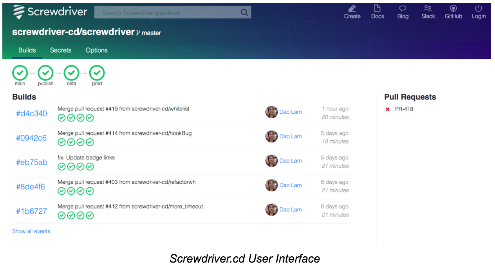

<!--truncate-->

[//]: # (Copyright Jiaqi Liu)

[//]: # (Licensed under the Apache License, Version 2.0 &#40;the "License"&#41;;)
[//]: # (you may not use this file except in compliance with the License.)
[//]: # (You may obtain a copy of the License at)

[//]: # (    http://www.apache.org/licenses/LICENSE-2.0)

[//]: # (Unless required by applicable law or agreed to in writing, software)
[//]: # (distributed under the License is distributed on an "AS IS" BASIS,)
[//]: # (WITHOUT WARRANTIES OR CONDITIONS OF ANY KIND, either express or implied.)
[//]: # (See the License for the specific language governing permissions and)
[//]: # (limitations under the License.)

Continuous Delivery enables software development teams to move faster and adapt to users' needs quicker by reducing the
inherent friction associated with releasing software changes. Yahoo's engineering has modernized as it has embraced
Continuous Delivery as a strategy for improving product quality and engineering agility. All our active products deliver
from commit to production with full automation and this has greatly improved Yahoo's ability to deliver products.

Part of what enabled Yahoo to make Continuous Delivery at scale a reality was our improved build and release tooling.
Now, we are open sourcing an adaptation of our code as [Screwdriver.cd](http://screwdriver.cd/), a new streamlined build
system designed to enable Continuous Delivery to production at scale for dynamic infrastructure.

Some of the key design features of Screwdriver have helped Yahoo achieve Continuous Delivery at scale. At a high level
these are:

- Making deployment pipelines easy
- Optimizing for trunk development
- Making rolling back easy

**Easy deployment pipelines**: Deployment pipelines that continuously test, integrate, and deploy code to production
greatly reduce the risk of errors and reduce the time to get feedback to developers. The challenge for many groups had
been that pipelines were cumbersome to setup and maintain. We designed a solution that made pipelines easy to configure
and completely self-service for any developer. By managing the pipeline configuration in the code repository Screwdriver
allows developers to configure pipelines in a manner familiar to them, and as a bonus, to easily code review pipeline
changes too.

**Trunk development**: Internally, we encourage workflows where the trunk is always shippable. Our teams use a modified
[GitHub flow](https://guides.github.com/introduction/flow/) for their workflows. Pull Requests (PRs) are the entry point
for running tests and ensuring code that entered the repository has been sufficiently tested. Insisting on formal PRs
also improves the quality of our code reviews.

To ensure trunks are shippable, we enable functional testing of code in the PRs. Internally, this is a configuration
baked into pipelines that dynamically allocates compute resources, deploys the code, and runs tests. These tests include
web testing using tools like Selenium. These dynamically-allocated resources are also available for a period after the
PR build, allowing engineers to interact with the system and review visual aspects of their changes.

**Easy rollbacks**: To allow for easy code rollbacks, we allow phases of the pipeline to be re-run at a previously-saved
state. We leverage features in our PaaS to handle the deployment, but we store and pass metadata to enable us to re-run
from a specific git SHA with the same deployment data. This allows us to roll back to a previous state in production.
This design makes rolling back as easy as selecting a version from a dropdown menu and clicking "deploy". Anyone with
write access to the project can make this change. This helped us move teams to a DevOps model where developers were
responsible for the production state.

The successful growth of Screwdriver over the past 5 years at Yahoo has today led to Screwdriver being synonymous with
Continuous Delivery within the company. **Screwdriver handles over 25,000+ builds per day and 12,000+ daily git commits
as a single shared entrypoint for Yahoo. It supports multiple languages and handles both virtual machine and
container-based builds and deployment**.

Screwdriver.cd's architecture is comprised of four main components: a frontend for serving content to the user, a
stateless API that orchestrates between user interactions and build operations, the execution engines (Docker Swarm,
Kubernetes, etc.) that checkout source code and execute in containers, and the launcher that executes and monitors
commands inside the container.

The diagram below shows this architecture overlaid with a typical developer flow.

To give some context around our execution engines, internal Screwdriver started as an abstraction layer on top of
Jenkins and used Docker to provide isolation, common build containers, etc. We used features provided by Jenkins plugins
to leverage existing work around coverage and test reports. However, as Screwdriver usage continued to climb, it outgrew
a single Jenkins cluster. So in order to grow to our needs, we added capabilities in Screwdriver that allowed us to
scale horizontally while also adding capabilities to schedule pipelines across a number of Jenkins clusters. As we
scaled Screwdriver, we used less from Jenkins and built more supporting services utilizing our cloud infrastructure. The
open-source version is focused on Kubernetes and Docker Swarm as our primary supported execution engines.
