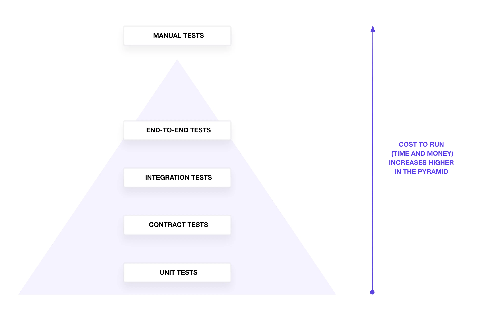

How do we know if we can run `terraform apply` to our infrastructure without negatively affecting critical business
applications? We can run `terraform validate` and `terraform plan` to check our configuration, but will that be enough?
Whether we've updated some HashiCorp Terraform configuration or a new version of a module, we want to catch errors
quickly before we apply any changes to production infrastructure.

In this post, We will discuss some testing strategies for HashiCorp Terraform configuration and modules so that we can
`terraform apply` with greater confidence.

The Testing Pyramid
-------------------

In theory, we might decide to align our infrastructure testing strategy with the test pyramid, which groups tests by
type, scope, and granularity. The testing pyramid suggests that we write fewer tests in the categories at the top of the
pyramid, and more at the bottom. Those on the pyramid take more time to run and cost more due to the higher number of
resources we have to configure and create.

In reality, our tests may not perfectly align with the pyramid shape. The pyramid offers a common framework to describe
what scope a test can cover to verify configuration and infrastructure resources. We'll start at the bottom of the
pyramid with unit tests and work the way up the pyramid to end-to-end tests.

:::note

hashicorp-aws does not merit any manual testing; so it is not discussed here

:::

Linting and Formatting
----------------------

While not on the test pyramid, we often encounter tests to verify the hygiene of your Terraform configuration. Use
`terraform fmt -check` and terraform validate to format and validate the correctness of our Terraform configuration.

When we collaborate on Terraform, we may consider testing the Terraform configuration for a set of standards and best
practices. Build or use a linting tool to analyze our Terraform configuration for specific best practices and patterns.
For example, a linter can verify that our teammate defines a Terraform variable for an instance type instead of
hard-coding the value.

Unit Tests
----------

At the bottom of the pyramid, unit tests verify individual resources and configurations for expected values. They should
answer the question, “Does my configuration or plan contain the correct metadata?” Traditionally, unit tests should run
independently, without external resources or API calls.
